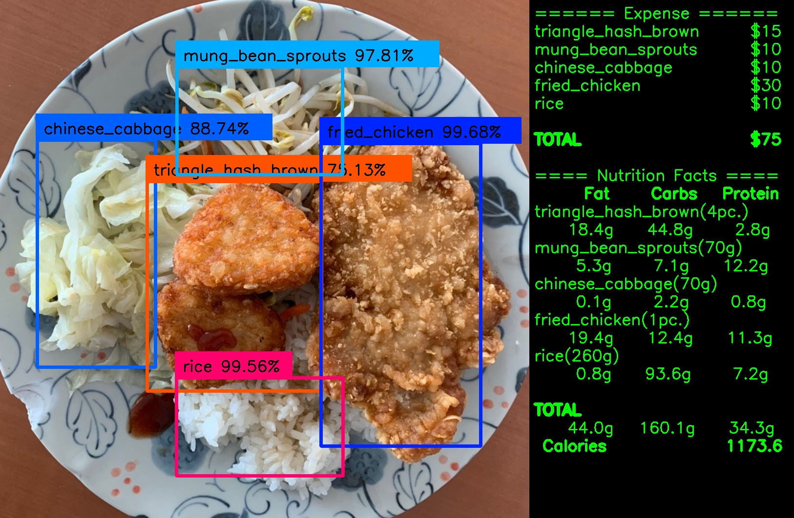

# Chinese Cafeteria Food Recognition
One of the common running themes in the campus cafeteria is the hold up in foot traffic in queueing due to food checkout. We find out that the bottleneck is caused by the staff requiring extra time to look up the prices of those miscellaneous entrees and calculate the total due amount. Thus, we were inspired to build up an object detection model that recognizes entrees in the plate and calculates the total due amount automatically. With the model, the staff no longer need to perform mental calculations.

### Long Waiting Queue During Checkout


### Realtime Model Inferencing


### Prices/Nutrition Facts Are Calculated and Displayed in the Right


For more details on this project, checkout our [project report](asset/project_report.pdf) or [conference paper](asset/conference_paper.pdf).

## Tested Compatible Environment
- Python 3.7
- NumPy 1.16.0
- Tensorflow 1.13.2
- Keras 2.2.5
- OpenCV (not version dependent)
- tqdm (not version dependent)

## Usage

### Further Training
Train the model base on the settings in the `config.json`.
```
python train.py -c config.json
```

### Evaluation
One can evaluate the model accuracy with the following command after training.
```
python evaluate.py -c config.json
```

### Prediction

#### Single Image
```
python predict.py -c config.json -i /path/to/the/image [-o /path/to/the/output/folder/]
```

#### A Folder of Images
```
python predict.py -c config.json -i /path/to/the/image/folder [-o /path/to/the/output/folder/]
```

#### Video File
```
python predict.py -c config.json -i /path/to/the/video [-o /path/to/the/output/folder/]
```

#### Live Webcam
```
python predict.py -c config.json -i webcam0
```

The number `0` in the parameter `webcam0` can be changed to the number of the order of the webcam installed on your device.

## Credits
Special thanks to experiencor/keras-yolo3 repository which provides an implementation of YOLOv3 by using Python, TensorFlow and Keras:)